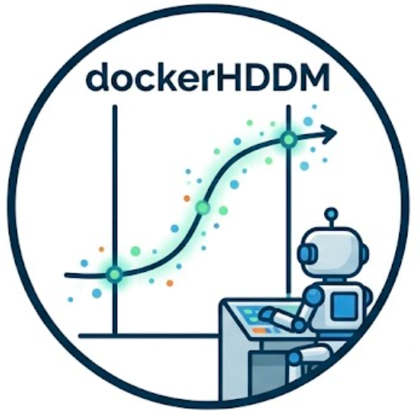

<p align="center"></p>

# dockerHDDM skill

> [中文版](README_zh.md)

A reusable agent skill for building, explaining, simulating, inferring, organizing, and debugging **dockerHDDM 1.1** projects. It wraps the maintained HDDM, Kabuki, PyMC2, ArviZ, and ssm-simulators stack so that trial-level drift-diffusion (DDM / HDDM) modeling is reproducible from a single slash command.

Slash command: **`/dockerhddm-workflow`**

## Overview

The skill routes each request to the right workflow before any code is written, then enforces a strict data contract and a layered debugging discipline. It is designed to run against the pinned dockerHDDM `1.1.0` runtime, not an arbitrary upstream HDDM install.

## Workflows

| Mode | When to use | Entry point |
|------|-------------|-------------|
| **Inference** | Trial-level data exist | `references/inference-workflow.md` |
| **Simulation / prediction** | Parameters, ranges, or theory exist | `references/simulation-prediction-workflow.md` |
| **Debugging** | Error, crash, implausible result, or design concern | `references/debugging.md` |
| **Project init** | User wants a clean reusable project | `scripts/init_project.py` + `references/project-layout.md` |
| **API explanation** | How HDDM / Kabuki / PyMC2 calls flow | `references/api-hddm.md`, `references/api-kabuki-pymc2.md` |
| **Experimental planning** | Task or sample-size question | `references/experimental-design.md` |

Hybrid requests are handled in this order: simulate → recovery → fit real data → diagnostics → PPC / model comparison → interpretation.

## Quick start

Initialize a reusable project layout from the bundled template:

```bash
python scripts/init_project.py <project-dir> --mode inference
python scripts/init_project.py <project-dir> --mode simulation
python scripts/init_project.py <project-dir> --mode hybrid
```

Inspect the target environment before assuming any API:

```bash
python scripts/inspect_environment.py
```

Estimate memory needs before expensive sampling:

```bash
python scripts/estimate_memory.py
```

## Features

- Routes intents to curated workflows instead of ad-hoc prompts.
- Enforces a one-row-per-trial data contract (RT in seconds, required columns, documented coding).
- Produces a full inference pipeline: validation → baseline → smoke fit → production sampling → diagnostics → PPC → recovery.
- Distinguishes forward, condition/grid, hierarchical, posterior-predictive, and recovery simulations.
- Debugs in layers (environment → mount → schema → model → sampling → InferenceData → convergence → assumptions).
- Ships 40 converted reference notebooks plus curated reading and literature guides.
- Privacy-aware: translates example structure into generic role folders, never exposing raw data or credentials.

## Reference routing

- Curated notebook navigation: `references/notebook-routing.md`
- All converted notebooks: `references/notebooks/index.md`
- Article recommendations: `references/zhihu-reading-guide.md`
- Literature synthesis: `references/literature-guide.md`
- Pan et al. (2025) dockerHDDM paper: `references/literature/pan-2025-dockerhddm.md`
- Boag et al. (2025) experimental planning: `references/literature/boag-2025-experimental-planning.md`

## Tech stack

| Component | Technology |
|-----------|------------|
| Bayesian inference | HDDM, Kabuki, PyMC2 |
| Diagnostics | ArviZ |
| Simulators | ssm-simulators |
| Runtime | dockerHDDM 1.1.0 (container) |
| Language | Python |

## License

MIT
